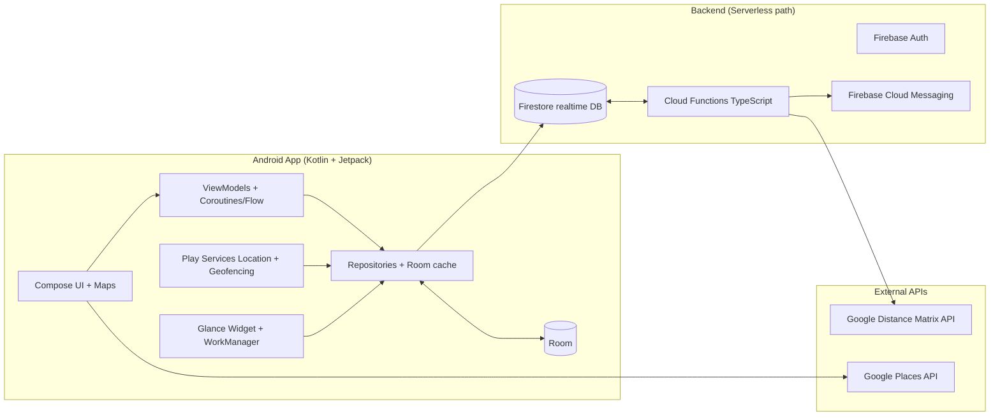

Presence Meetups – Architecture & Tech Stack Blueprint (MVP)

## 1) What we’re building (in one paragraph)

A realtime “friends-nearby for meetups” app: users can announce they’re going to a place (time-boxed), see which friends are there or interested, view ETAs to the venue, and (optionally) share approximate live location with selected friends. It must be privacy-first, battery-friendly, snappy (sub-second count updates), and support an Android home-screen widget.

---

## 2) High-level architecture



**Why this shape?**

* Firestore gives realtime streams and solves “who’s here/how many?” with minimal ops.
* Cloud Functions do the heavy lifting (aggregation, notifications, ETA computation).
* Client stays lightweight: subscribe to aggregates, publish presence, render UI.

---

## 3) Core domain objects (Firestore collections)

```json
// users/{userId}
{
  "displayName": "Ari",
  "avatarUrl": "...",
  "friends": ["u2","u3"],
  "circles": { "close": ["u2","u3"] },
  "settings": { "defaultPrecision": "approx", "defaultVisibility": "friends" }
}

// venues/{placeId}
{
  "name": "Blue Bottle",
  "lat": 37.78, "lng": -122.40, "geohash": "9q8yy...", "address": "...",
  "provider": "google", "lastUpdated": 1690000000
}

// plans/{planId}
{
  "ownerId": "u1", "placeId": "p1",
  "startsAt": 1690000000, "endsAt": 1690003600,
  "visibility": { "type": "selected|friends|circle", "allow": ["u2","u3"] },
  "note": "Quick coffee", "status": "active|ended", "createdAt": 169...
}

// presence/{userId}   // one active doc per user (TTL/refresh)
{
  "userId": "u2", "placeId": "p1",
  "lat": 37.78, "lng": -122.40, "geohash": "9q8yy...", "precise": false,
  "expiresAt": 1690001800
}

// interests/{id}
{
  "planId": "plan123", "userId": "u3", "mode": "interested|goingSoon", "createdAt": 169...
}

// place_aggregates/{placeId}
{
  "countHere": 3, "countInterested": 5,
  "sampleFriendIds": ["u2","u3"],
  "interestedEtas": { "u3": { "mode":"interested", "etaMins": 12 } },
  "updatedAt": 169...
}

// devices/{userId}/tokens/{tokenId}
{ "fcmToken":"...", "platform":"android", "updatedAt":169... }
```

**Read model vs. write model:** clients mostly read from `place_aggregates` (cheap & fast). Writes go to `presence`, `plans`, `interests`; Functions update `place_aggregates`.

---

## 4) Data flow (MVP)

1. User starts a plan or taps **“Share now”** → app writes `plans` and/or `presence` with a short  **expiresAt** .
2. A Cloud Function triggers on presence/interest changes → recomputes counts and ETAs → updates `place_aggregates`.
3. Clients **subscribe** to `place_aggregates/{placeId}` and render “# here / # interested / ETAs”.
4. Widget reads a cached shortlist from Room; it refreshes via WorkManager and on FCM “nudge” messages.
5. Periodic cleanup (Functions) expires stale `presence` records.

---

## 5) Privacy & security model

* **Opt-in, time-boxed sharing** : presence auto-expires (e.g., 15 minutes unless renewed).
* **Precision controls** : `precise=true` (exact venue/map pin) vs. `precise=false` (snap to venue centroid or coarse geohash).
* **Least privilege reads** : Firestore Security Rules enforce that only allowed viewers can see a plan/presence/aggregate.
* **Data minimization** : keep `presence` ≤ 24h; retain only aggregates longer term.
* **Abuse controls** : block/report; server rules prevent blocked users from seeing each other’s data.
* **Android compliance** : show prominent disclosure for any background location; use foreground service **only while** sharing.

**Security Rules (sketch):**

```javascript
rules_version = '2';
service cloud.firestore {
  match /databases/{db}/documents {
    function isFriend(uid, target) {
      return exists(/databases/$(db)/documents/users/$(target)) &&
             get(/databases/$(db)/documents/users/$(target)).data.friends.hasAny([uid]);
    }

    match /plans/{planId} {
      allow read: if resource.data.visibility.type == 'friends' && isFriend(request.auth.uid, resource.data.ownerId)
                  || (resource.data.visibility.type == 'selected' && resource.data.visibility.allow.hasAny([request.auth.uid]))
                  || (resource.data.visibility.type == 'circle' /* circle check omitted here */);
      allow create, update: if request.auth.uid == request.resource.data.ownerId;
    }

    match /presence/{uid} {
      allow read: if isFriend(request.auth.uid, uid);
      allow create, update: if request.auth.uid == uid;
      allow delete: if request.auth.uid == uid;
    }

    match /place_aggregates/{placeId} {
      // Option A (simpler MVP): readable to authenticated users; payload does not leak identities unless permitted.
      // Option B (stricter): use per-user filtered aggregates (more complex, higher cost).
      allow read: if request.auth != null;
      allow write: if false; // only by Cloud Functions with Admin SDK
    }
  }
}
```

---

## 6) Android app stack (what each piece is & why)

* **Kotlin** : primary language; concise, coroutine-friendly; first-class Android support.
* **Jetpack Compose** : modern declarative UI toolkit. Faster UI iteration, less boilerplate than XML.
* **Hilt (Dagger)** : dependency injection; clean module boundaries and testability.
* **Coroutines + Flow** : structured concurrency + reactive streams for Firestore listeners and location flows.
* **Room** : local SQLite ORM; caches recent places/aggregates for fast cold starts and widget data.
* **WorkManager** : OS-friendly background work (periodic widget refresh, backoff, constraints).
* **Glance** : Jetpack library for **home-screen widgets** using a Compose-like API.
* **Google Play Services – FusedLocationProviderClient** : low-power, fused (GPS/Wi-Fi/Cell) location. Prefer `PRIORITY_BALANCED_POWER_ACCURACY`; switch to high accuracy only when the map is open.
* **Android Geofencing API** : wakes the app when entering/exiting venue vicinities; reduces continuous GPS use.
* **Maps Compose** : Compose wrapper for Google Maps SDK; map rendering & camera control.
* **Firebase Auth** : email/password, phone, or federated sign-in; gives `uid` for Rules.
* **Cloud Firestore** : NoSQL document DB with realtime listeners; offline cache built-in; good for presence and counters.
* **Cloud Functions (TypeScript)** : serverless triggers & REST endpoints if needed; compute aggregates, ETAs, and send FCM.
* **Firebase Cloud Messaging (FCM)** : push notifications and “data messages” to prompt widget/UI refresh.
* **Google Places API** : venue search/details (name, address, placeId, lat/lng).
* **Google Distance Matrix API** : batched travel times (driving/walking/transit); we cache results for a few minutes.

**Common alternatives (production-scale paths):**

* **Supabase** (Postgres + Row-Level Security + Realtime) instead of Firebase; write triggers to maintain aggregates; add **Redis** for presence TTLs; small **Node (Fastify)** service for Distance Matrix batching and WebPush.
* **Atlas/MongoDB + Realm Sync** if you prefer JSON documents and client-driven sync.
* **Mapbox** instead of Google Maps/Places (license/cost considerations).
* **GraphQL (Hasura/StepZen)** if you want typed schemas and subscriptions.

---

## 7) Cloud Functions responsibilities (MVP)

1. **Aggregate updater**

   Trigger: `onWrite` to `/presence/*` or `/interests/*`

   * Query active presence for `placeId` (where `expiresAt > now`).
   * Query active interests for plans targeting that `placeId`.
   * Compute `countHere`, `countInterested`, sample friend IDs (redact if privacy demands), **batch ETAs** via Distance Matrix (see #8).
   * Upsert `place_aggregates/{placeId}`.
2. **Threshold notifications**

   * If counts cross user-defined thresholds (e.g., “Ping me when ≥2 friends are here”), send FCM data message.
3. **Garbage collection**

   * Scheduled function to delete expired `presence` and `interests` and end `plans` past `endsAt`.

**Function sketch (TypeScript):**

```ts
export const onPresenceWrite = functions.firestore
  .document("presence/{uid}")
  .onWrite(async (change, ctx) => {
    const after = change.after.exists ? change.after.data() : null;
    const placeId = after?.placeId ?? change.before.data()?.placeId;
    if (!placeId) return;

    const activePresence = await db.collection("presence")
      .where("placeId", "==", placeId)
      .where("expiresAt", ">", admin.firestore.Timestamp.now())
      .get();

    const interested = await db.collection("interests")
      .where("createdAt", ">", cutoff()) // optional time window
      .get();

    const countHere = activePresence.size;
    const countInterested = interested.size; // filter by plans->placeId if you model interests per plan
    const etas = await etaService.compute(/* interested users */, placeId);

    await db.doc(`place_aggregates/${placeId}`).set({
      countHere, countInterested, interestedEtas: trim(etas, 10),
      updatedAt: admin.firestore.Timestamp.now()
    }, { merge: true });
});
```

---

## 8) Travel time (ETA) strategy

* **Server-side batching** in Functions via Distance Matrix API to avoid leaking keys and to dedupe requests.
* **Caching** : key by `(originCell, placeId, mode)` where `originCell` is a coarse geohash of the friend’s last known location; TTL 2–5 minutes.
* **Cost control** : only compute ETAs for visible friends (respect visibility rules), cap per aggregate (e.g., top 10).

---

## 9) App feature slices (Android)

* **Plan creation** : venue picker (Places Autocomplete) → time window → visibility.
* **Place feed** : nearby venues (by geohash bounds) with `place_aggregates` summaries.
* **Map view** : clusters of friends/venues; precise vs approximate pins based on privacy setting.
* **Detail screen** : who’s here, who’s interested, ETAs, quick actions (“Interested”, “Going”).
* **Widget** : top 3 nearby places with counts; tap-through deep links.

**Recommended module layout**

```
app/
core/ (di, utils, Result, dispatcher providers)
data/ (Firestore DTOs, Room entities, repositories)
domain/ (use-cases, mappers, validators)
feature-plan/
feature-feed/
feature-map/
feature-widget/
```

---

## 10) Performance, battery, and responsiveness

* **Targets** : <400 ms for count updates (realtime stream), <2 s for ETA fill-in, <1 s cold-start to first content (from Room cache).
* **Location** : use `PRIORITY_BALANCED_POWER_ACCURACY`; escalate precision only when necessary (map).
* **Geofences** : set around *selected* venues to wake for updates instead of polling.
* **Minimize writes** : keep 1 presence doc per user; extend `expiresAt` with a cheap `set(merge=true)` heartbeat.
* **Room first** : draw UI from cache immediately, reconcile with Firestore stream.

---

## 11) Testing & observability

* **Unit** : repositories, Rules emulator tests, visibility/eligibility logic.
* **Instrumentation** : Compose UI state tests, location permission flows.
* **Emulators** : Firebase emulators (Auth/Firestore/Functions) for fast local dev.
* **Metrics** : Cloud Logging + simple Firestore counters; privacy-safe analytics (no raw lat/lng).
* **Chaos** : airplane-mode tests, clock skew, delayed FCM, revoked permissions.

---

## 12) CI/CD & environments

* **CI** : Gradle builds + lint + unit tests + Firebase Emulator tests on PR.
* **CD** : Internal testing track on Play; Functions deploy via `firebase deploy --only functions`.
* **Config** : use `BuildConfig`/Remote Config for API toggles, staging vs prod; separate Firebase projects.

---

## 13) Cost & limits (rule-of-thumb, MVP)

* Firestore reads scale with subscribers to `place_aggregates`. Keep aggregates compact; prefer  **one doc per place** .
* Distance Matrix is the cost hot-spot → cache aggressively, compute for visible friends only.
* FCM is free; Cloud Functions cost is minor for modest traffic.

---

## 14) “What if we outgrow this?”

* Move presence to **Redis** (TTL keys) or  **Pub/Sub** ; Firestore holds durable plans & aggregates only.
* Precompute **per-user filtered aggregates** (privacy-perfect, but more writes) if privacy needs tighten.
* Shift to Supabase/Postgres with **RLS policies** and `LISTEN/NOTIFY` for realtime.

---

## 15) Quickstart for new devs

1. **Android Studio** (latest), JDK 17.
2. **Clone & run** : `app` module compiles without backend—mock repositories supply data.
3. **Switch on Firebase** : add `google-services.json`, enable Auth (email link or Google), run emulators.
4. **Deploy Functions** : `firebase init` → `functions` (TypeScript) → deploy to staging project.
5. **Maps/Places keys** : create restricted API keys (Android key; HTTP key for Functions).
6. **Smoke test** : create a plan, mark “Interested” on another account, watch aggregates update.

---

## 16) Minimal code references (trimmed for orientation)

**Presence write (low power):**

```kotlin
val loc = fused.getCurrentLocation(Priority.PRIORITY_BALANCED_POWER_ACCURACY, null).await()
firestore.collection("presence").document(currentUserId).set(
  mapOf("userId" to currentUserId, "placeId" to placeId,
        "lat" to loc.latitude, "lng" to loc.longitude,
        "geohash" to geoHash(loc), "precise" to precise,
        "expiresAt" to Timestamp(Date(System.currentTimeMillis() + 15*60*1000)))
, SetOptions.merge()).await()
```

**Listen to aggregates:**

```kotlin
fun aggFlow(placeId: String) = callbackFlow {
  val reg = fs.collection("place_aggregates").document(placeId)
    .addSnapshotListener { s, e -> if (e==null && s?.exists()==true) trySend(s.toObject(PlaceAggregate::class.java)!!) }
  awaitClose { reg.remove() }
}
```

**Glance widget outline:**

```kotlin
class NearbyPlansWidget: GlanceAppWidget() {
  @Composable override fun Content() {
    val items = remember { repo.cachedTop3() }
    Column(GlanceModifier.padding(12.dp)) {
      Text("Friends Near You")
      items.forEach { row(it) }
      Button(text="Open Map", onClick=actionStartActivity(MainActivity.intent()))
    }
  }
}
```

---

## 17) Glossary (what each tool is, in plain English)

* **Jetpack Compose** : Modern Android UI toolkit. You describe UI as functions; the framework draws and updates it efficiently.
* **Hilt** : A dependency injection wrapper over Dagger; it wires your classes together automatically, enabling clean testing.
* **Coroutines / Flow** : Kotlin’s lightweight concurrency. `Flow` is an observable stream (perfect for realtime DB updates).
* **Room** : Local database layer over SQLite for caching and offline use.
* **WorkManager** : Schedules reliable background tasks that respect battery and OS constraints.
* **Glance** : Build Android home-screen widgets with a Compose-like API.
* **FusedLocationProviderClient** : Google’s unified location provider; balances GPS/Wi-Fi/Cell to save battery.
* **Geofencing API** : Triggers enter/exit events around coordinates without running constant GPS.
* **Maps Compose** : Compose integration for Google Maps—render maps, markers, and gestures.
* **Firebase Auth** : Simple, secure user sign-in; gives a user ID (`uid`) used everywhere.
* **Cloud Firestore** : Realtime document DB with offline sync. Great for pub/sub-ish UI without running servers.
* **Cloud Functions** : Serverless JS/TS code that runs on events (DB writes, HTTP calls).
* **Firebase Cloud Messaging (FCM)** : Push notifications & silent data messages to the app.
* **Google Places API** : Search/select real venues; returns name/address/IDs/coordinates.
* **Google Distance Matrix API** : Travel times between origins and destinations (driving/walking/transit).
* **Geohash** : Encodes lat/lng into a sortable string; enables “nearby” queries by prefix ranges.
* **Supabase** : Open-source Firebase-like stack on Postgres with **Row-Level Security** and live updates.
* **Redis** : In-memory store with key TTL—excellent for ephemeral presence.

---

## 18) Known risks & mitigations

* **Privacy leakage via aggregates** → never include identity lists unless viewer is authorized; consider per-viewer filtered docs if needed.
* **API cost spikes (Distance Matrix)** → cache, cap, and compute only for visible friends.
* **Battery drain** → geofences over polling; low-power location by default; throttle heartbeats.
* **Firestore read amplification** → batch UI into “nearby top N places”, not dozens of listeners.

---

If you want, I can produce a repo skeleton (Android + Functions) matching this blueprint so your team can start from a working baseline with stubs for each module and one or two end-to-end flows pre-wired.
